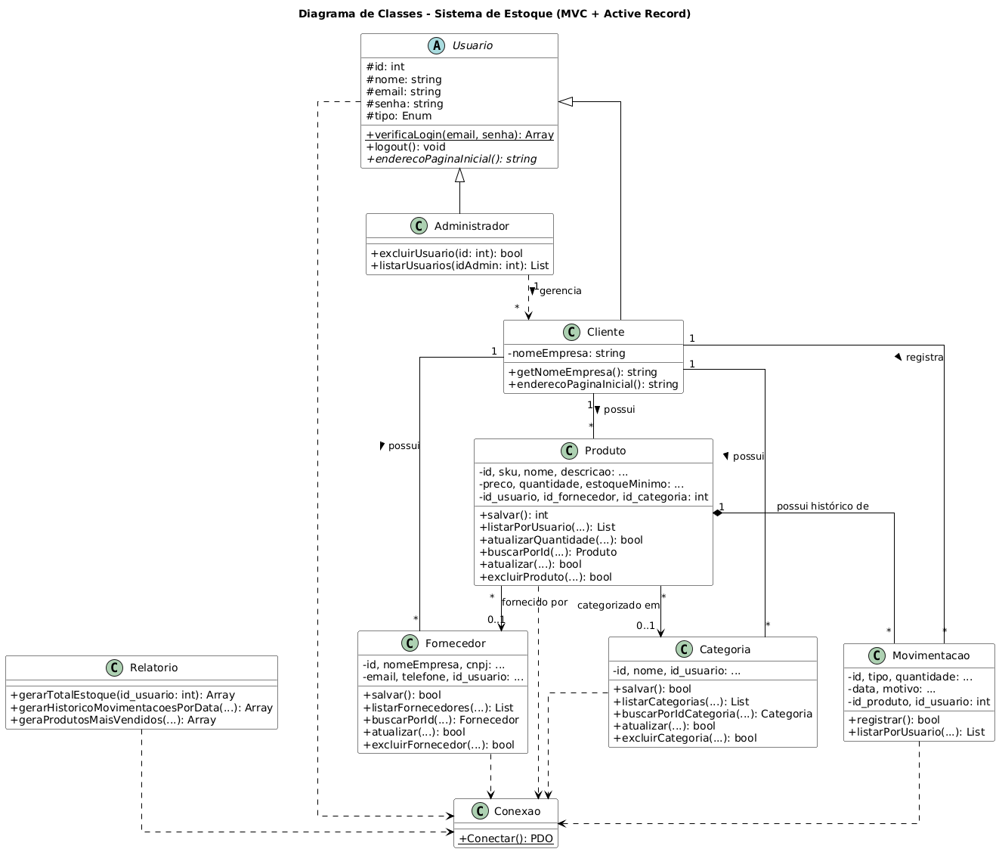

  <h1>📦 Protótipo - Sistema de Gerenciamento de Estoque</h1>
  

    Um sistema web desenvolvido em <strong>PHP Puro</strong>, focado na aplicação prática de Engenharia de Software.
  

  
  

    <a href="#-sobre-o-projeto">Sobre</a> •
    <a href="#-arquitetura-e-conceitos">Arquitetura</a> •
    <a href="#-funcionalidades">Funcionalidades</a> •
    <a href="#-como-executar">Como Executar</a>
  

## 📝 Sobre o Projeto

Este projeto é um **Sistema de Controle de Estoque Multi-usuário**. O objetivo principal foi criar uma aplicação onde múltiplas empresas (clientes) pudessem gerenciar seus estoques dentro da mesma plataforma, garantindo total privacidade e segurança dos dados.

O sistema simula um modelo de negócio **SaaS (Software as a Service)**:
> **Nota de Negócio:** Não existe uma tela de "Cadastre-se" pública. A ideia é que o sistema seja comercializado por mensalidade. O **Administrador** (dono do software) cadastra a empresa contratante diretamente no banco de dados. Após o primeiro acesso, o cliente pode gerenciar seus dados na área "Meu Perfil".

---

## 🏗️ Arquitetura e Conceitos

Este projeto foi desenvolvido com forte ênfase em padrões de projeto e boas práticas de programação:

* **POO (Programação Orientada a Objetos):** Todo o sistema é baseada em Classes, Objetos, Herança (ex: `Usuario` -> `Cliente`) e Encapsulamento.
* **Padrão MVC (Model-View-Controller):** Separação clara entre a lógica de negócios (Model), a interface visual (View) e o controle de fluxo (Controller), facilitando a manutenção e escalabilidade.
* **Isolamento de Dados (Multi-Tenancy):** Implementação de uma arquitetura onde cada usuário vê **apenas** os seus próprios dados (Produtos, Fornecedores e Categorias), mesmo compartilhando o mesmo banco de dados.
* **Service Layer (Camada de Serviço):** Utilização de classes especializadas (ex: `Relatorio`) para processamento de dados complexos e geração de gráficos, separando a lógica de consulta da lógica de entidade.

### 📐 Diagrama de Classes

  
   
  <i>Estrutura de classes e relacionamentos do sistema.</i>

---

## 🚀 Funcionalidades

O sistema possui dois níveis de acesso com responsabilidades distintas:

### 👤 Perfil: Cliente (Empresa)
O cliente tem acesso a um **Dashboard** intuitivo para gerenciar seu negócio:
* **Gestão de Produtos:** Cadastrar, listar, editar e excluir produtos.
* **Controle de Categorias:** Organizar produtos por categorias próprias.
* **Gestão de Fornecedores:** Manter base de dados de parceiros.
* **Movimentação de Estoque:** Registrar entradas e saídas de mercadoria (atualiza saldo automaticamente).
* **Alertas Visuais:** Indicação visual na lista quando um produto atinge o estoque mínimo.
* **Relatórios Gerenciais (Novo):** * **Financeiro:** Visualização do valor total investido em estoque.
    * **Histórico:** Extrato detalhado de movimentações por período.
    * **Ranking:** Gráficos interativos (Barras) dos produtos com maior saída/venda.
    * **Exportação:** Funcionalidade de impressão otimizada (simulação de PDF).
* **Meu Perfil:** Alteração de dados cadastrais e senha.

### 🛡️ Perfil: Administrador (Dono)
* **Gestão de Usuários:** Visualizar e gerenciar as empresas que utilizam o sistema.
* **Exclusão em Cascata(Banco de Dados):** Ao excluir um cliente inadimplente, o sistema limpa automaticamente todos os produtos e dados vinculados a ele.

---

## 💻 Tecnologias Utilizadas

O projeto foi construído sem o uso de frameworks backend, a ideia é praticar as operações de CRUD utilizando uma linguagem acessível como o PHP:

* **Back-end:** PHP 8+ (Puro/Nativo).
* **Banco de Dados:** MySQL (Uso de PDO para segurança).
* **Front-end:** HTML5 e CSS3 (Design responsivo e limpo).
* **Bibliotecas JS:** Chart.js (para geração de gráficos dinâmicos).
* **Servidor:** Apache (via XAMPP).

---

## 🔧 Como Executar o Projeto

Para rodar este sistema na sua máquina local, siga os passos:

1.  **Ambiente:** Instale o [XAMPP](https://www.apachefriends.org/) (ou WAMP/Laragon).
2.  **Clone:** Baixe este repositório dentro da pasta `htdocs` do seu servidor.
3.  **Banco de Dados:**
    * Abra o PHPMyAdmin (`http://localhost/phpmyadmin`).
    * Crie um banco de dados chamado `sistema_estoque`.
    * Importe o arquivo `script_estoque.sql` (disponível na raiz deste projeto) para criar as tabelas e usuários padrão.
4.  **Configuração:**
    * Verifique se o arquivo `Config/Conexao.php` está com a senha/usuário corretos do seu MySQL.
5.  **Acesso:**
    * Abra o navegador e acesse: `http://localhost/NomeDaSuaPasta`.
    * **Login Admin:** `admin@sistema.com` | Senha: `123`
    * **Login Cliente:** `tech@cliente.com` | Senha: `123`

---

<footer align="center">
  
Desenvolvido por <strong>Luciano Simas Junior</strong>

  
Projeto Integrador (IFSC)- Técnico em Desenvolvimento de Sistemas

</footer>
